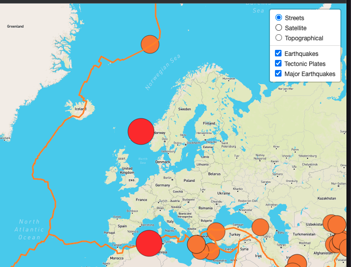
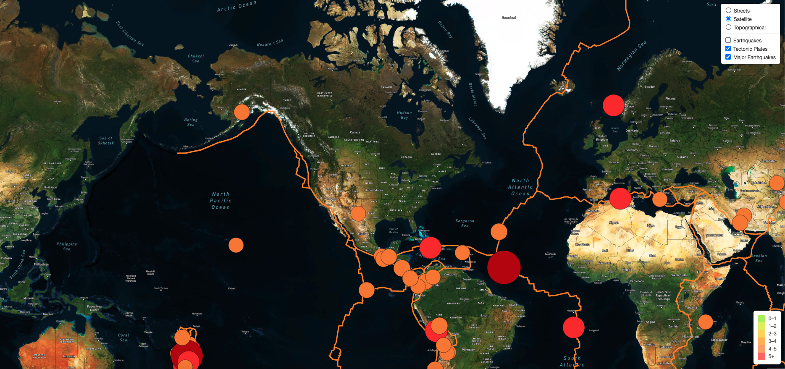
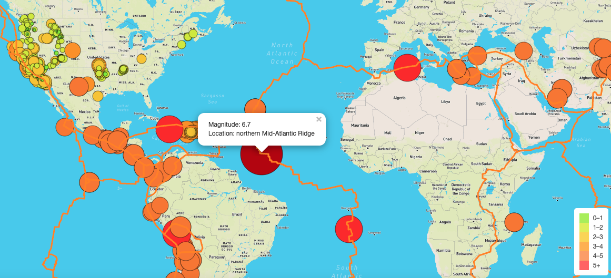

# Mapping_Earthquakes

## Overview 
For our 13th data analytics project, we created an intereactive map using leafletjs controls and base maps from Mapbox to display Earthquake data all over the world over the previous 7 days. the data is provided, via APIs, from the US Geological Survey website (usgs.gov) in the GeoJSON format.  Data is current and pulled down realtime on every page load.  

## Resources 

-  JavaScript 
    - D3 
    - Leaflet.js
-  GeoJSON files: 
    -  https://earthquake.usgs.gov/earthquakes/feed/v1.0/summary/all_week.geojson
    -  https://earthquake.usgs.gov/earthquakes/feed/v1.0/summary/4.5_week.geojson
    -  https://raw.githubusercontent.com/fraxen/tectonicplates/master/GeoJSON/PB2002_boundaries.json
-  HTML
-  CSS

## Results
We are able to toggle between 3 different base maps.  I included Steets view, Satellite Streets view, and a topographical view.  

Overlays:
We have provided 3 overlays that can be toggled on and off.  
- All Earthquakes (in the past 7 days)
- Tectonic Plates
- All Major Earthquakes (in the past 7 days) 

For the earthquakes layer, the size and color are both determined by the magnitude of earthquake.  In addition, each Earthquake can be clicked on to reveal the specific location and magnitude of the quake.  

